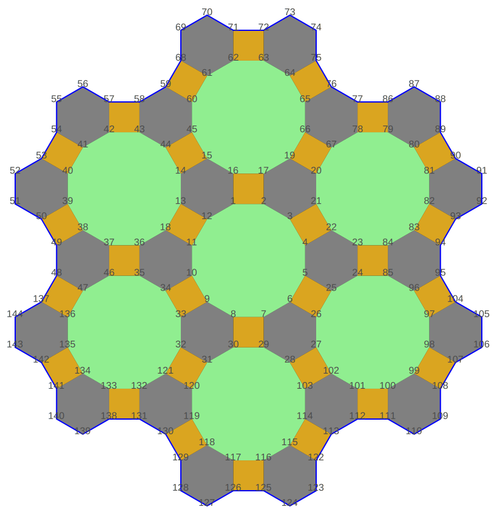

# Tilings by regular polygons

[](https://index.scala-lang.org/scala-tessella/tessella/tessella)
[](https://central.sonatype.com/search?q=tessella_3)
[](https://www.scala-js.org)
[](https://github.com/scala-tessella/tessella/actions/workflows/ci.yml)
[](https://scala-steward.org)
[](https://zenodo.org/doi/10.5281/zenodo.12747299)

**Tessella** is a Scala 3 library, compatible with Scala.js,
that helps to deal with finite unit-regular-polygon tessellations of a flat surface,
a classical theme in the wider field of [tessellations](https://en.wikipedia.org/wiki/Tessellation) (or _tilings_).

|  |
|---------------------------------------------------------------------|
| _SVG output for a `Tiling` of a [(4.6.12)] pattern_                 |

## Tessellation as graph

Each tessellation is internally described as an [undirected graph](https://en.wikipedia.org/wiki/Graph_(discrete_mathematics)#Undirected_graph), where:

*   each **node** of the graph is a _**vertex**_ of a polygon and it is represented by a unique `Int`
*   each **edge** of the graph is a _**side**_ of a polygon

The graph describing the tessellation is a `Tiling` object.

## Setup

Add the following dependency to your `build.sbt` file:
```scala
libraryDependencies += "io.github.scala-tessella" %% "tessella" % "0.3.0" // Use %%% instead of %% if you're using ScalaJS
```

## Getting started

First, start with the following import:

```scala
import io.github.scala_tessella.tessella.Tiling.*
```

Then you can write something like:

```scala
Tiling.fromPolygon(5) // Tiling(1--2, 1--5, 2--3, 3--4, 4--5)
Tiling.fromPolygon(7).graphNodes // List(1, 2, 3, 4, 5, 6, 7)
Tiling.fromPolygon(4).area // 1.0
```

## Documentation

### Scaladoc

The Scaladoc API documentation can be browsed and searched [here](https://scala-tessella.github.io/tessella/api/io/github/scala_tessella/tessella.html).

### Website

Check the [Tessella website](https://scala-tessella.github.io/tessella/) for more info.

## Deprecation warning 

**Tessella** is replacing the previous project at https://github.com/mcallisto/tessella, now deprecated.
