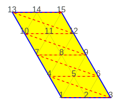
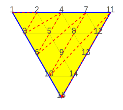
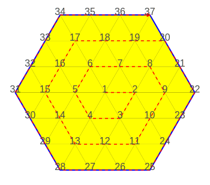
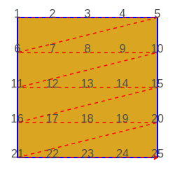
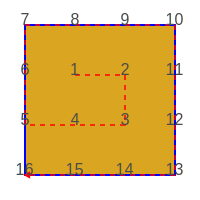

# Creation of regular tessellations

Finite sets of the 3 regular tessellations
(see @link:[Wikipedia](https://en.wikipedia.org/wiki/Euclidean_tilings_by_convex_regular_polygons#Regular_tilings) { open=new })
can be created.

## Triangle only, pattern [(3₆)]

### Fast reticulate method

```scala
Tiling.triangleNet(4, 4)
```
```raw
<div style="width: 420px;">
```
|  |
|-----------------------------------------------|
| _Finite set of a **[(3₆)]** pattern_          |
```raw
</div>
```

```scala
Tiling.triangleTriangle(4)
```
```raw
<div style="width: 420px;">
```
|  |
|-------------------------------------------------------------|
| _Finite set of a **[(3₆)]** pattern_                        |
```raw
</div>
```

### Slow growth method

```scala
TilingGrowth.growFullVertex(FullVertex.s("(3₆)"), 60) // same as Tiling.triangularHex(3)
```
```raw
<div style="width: 600px;">
```
|    |
|-------------------------------------------|
| _Finite set of a **[(3₆)]** pattern_      |
```raw
</div>
```

## Square only, pattern [(4₄)]

### Fast reticulate method

```scala
Tiling.squareNet(4, 4)
```
```raw
<div style="width: 440px;">
```
|    |
|--------------------------------------|
| _Finite set of a **[(4₄)]** pattern_ |
```raw
</div>
```

### Slow growth method

```scala
TilingGrowth.growFullVertex(FullVertex.s("(4₄)"), 9) // same as Tiling.squareNet(3)
```
```raw
<div style="width: 360px;">
```
|   |
|----------------------------------------|
| _Finite set of a **[(4₄)]** pattern_   |
```raw
</div>
```

## Hexagon only, pattern [(6₃)]

### Fast reticulate methods

```scala
Tiling.hexagonNet(4, 4)
```
```raw
<div style="width: 640px;">
```
|    |
|-------------------------------------------------|
| _Finite set of a **[(6₃)]** pattern_            |
```raw
</div>
```

```scala
Tiling.hexTrianguloid(4)
```
```raw
<div style="width: 640px;">
```
|   |
|----------------------------------------------------------|
| _Finite set of a **[(6₃)]** pattern_                     |
```raw
</div>
```

### Slow growth method

```scala
TilingGrowth.growFullVertex(FullVertex.s("(6₃)"), 19) // same as Tiling.hexagonalHexoid(3)
```
```raw
<div style="width: 800px;">
```
|    |
|-------------------------------------------|
| _Finite set of a **[(6₃)]** pattern_      |
```raw
</div>
```
