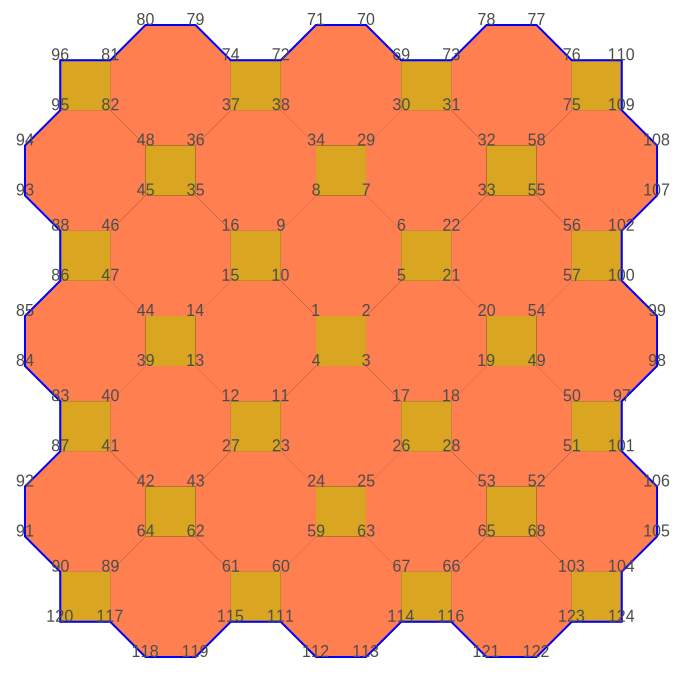

# Creation of semi regular tessellations

Finite sets of the 8 semi regular tessellations
(see @link:[Wikipedia](https://en.wikipedia.org/wiki/Euclidean_tilings_by_convex_regular_polygons#Archimedean,_uniform_or_semiregular_tilings) { open=new })
can be created.

## 1, pattern [(3⁴.6)]

`Tiling.triHexagonalHexoid(5)`

```raw
<div style="width: 540px;">
```
|  |
|--------------------------------------|
| _Finite set of a **(3⁴.6)** tiling_  |
```raw
</div>
```

## 2, pattern [(3³.4²)]

### Fast method

`Tiling.elongatedTriangular(6, 6)`

```raw
<div style="width: 400px;">
```
|   |
|--------------------------------------|
| _Finite set of a **(3³.4²)** tiling_ |
```raw
</div>
```

### Slow method

`Tiling.triSquareSquaroid(2)`

```raw
<div style="width: 360px;">
```
|  |
|--------------------------------------|
| _Finite set of a **(3³.4²)** tiling_            |
```raw
</div>
```

## 3, pattern [(3².4.3.4)]

`Growth.growFull(FullVertex.s("(3².4.3.4)"), 44)`

```raw
<div style="width: 360px;">
```
|       |
|-----------------------------------------|
| _Finite set of a **(3².4.3.4)** tiling_ |
```raw
</div>
```

## 4, pattern [(3.4.6.4)]

`Tiling.triSquareHexagonalHexoid(3)`

```raw
<div style="width: 660px;">
```
|         |
|-------------------------------------------|
| _Finite set of a **[(3.4.6.4)]** pattern_ |
```raw
</div>
```

## 5, pattern [(3.6.3.6)]

### Fast method

`Tiling.triHexagonal(6, 6)`

```raw
<div style="width: 400px;">
```
|       |
|-------------------------------------------|
| _Finite set of a **[(3.6.3.6)]** pattern_ |
```raw
</div>
```

### Slow method

`Tiling.triHexagonalHex(3)`

```raw
<div style="width: 540px;">
```
|       |
|-----------------------------------|
| _Finite set of a **[(3.6.3.6)]** pattern_ |
```raw
</div>
```

## 6, pattern [(3.12²)]

`Tiling.triDodecagonalHexoid(2)`

```raw
<div style="width: 600px;">
```
|          |
|-----------------------------------------|
| _Finite set of a **[(3.12²)]** pattern_ |
```raw
</div>
```

## 7, pattern [(4.6.12)]

`Tiling.squareHexDodecagonalHexoid(2)`

```raw
<div style="width: 800px;">
```
|                  |
|----------------------------------------------------|
| _Finite set of a **[(4.6.12)]** pattern_ |
```raw
</div>
```

## 8, pattern [(4.8²)]

`Tiling.squareOctogonalSquaroid(4)`

```raw
<div style="width: 660px;">
```
|        |
|-----------------------------------------|
| _Finite set of a **[((4.8²)]** pattern_ |
```raw
</div>
```
