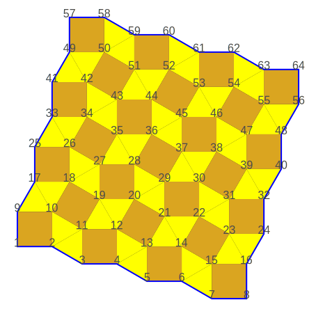
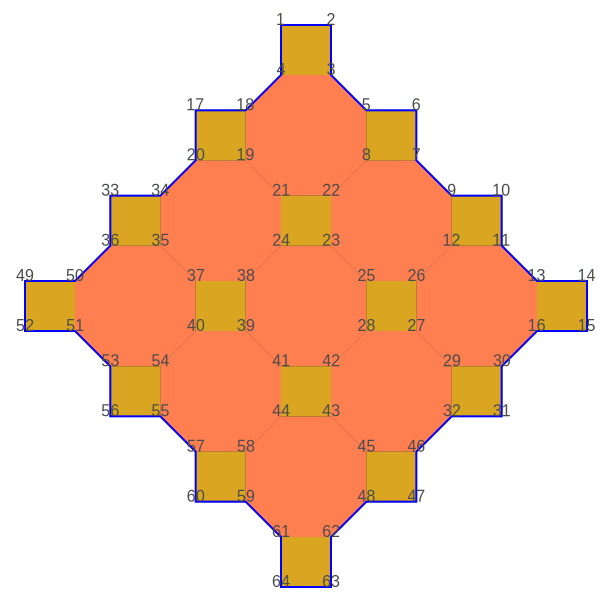

# Creation of semi regular tessellations

Finite sets of the 8 semi regular tessellations
(see @link:[Wikipedia](https://en.wikipedia.org/wiki/Euclidean_tilings_by_convex_regular_polygons#Archimedean,_uniform_or_semiregular_tilings) { open=new })
can be created.

## 1, pattern [(3₄.6)]

```scala
Tiling.pattern_33336(5)
```
```raw
<div style="width: 540px;">
```
|  |
|----------------------------------------|
| _Finite set of a **[(3₄.6)]** tiling_  |
```raw
</div>
```

## 2, pattern [(3₃.4₂)]

### Fast method

```scala
Tiling.pattern_33344(6, 6)
```
```raw
<div style="width: 400px;">
```
|     |
|----------------------------------------|
| _Finite set of a **[(3₃.4₂)]** tiling_ |
```raw
</div>
```

### Slow method

```scala
Tiling.pattern_33344(2)
```
```raw
<div style="width: 360px;">
```
|    |
|----------------------------------------|
| _Finite set of a **[(3₃.4₂)]** tiling_ |
```raw
</div>
```

## 3, pattern [(3₂.4.3.4)]

### Fast method

```scala
Tiling.pattern_33434(7, 7)
```
```raw
<div style="width: 480px;">
```
|           |
|-------------------------------------------|
| _Finite set of a **[(3₂.4.3.4)]** tiling_ |
```raw
</div>
```

### Slow method

```scala
Tiling.pattern_33434(3)
```
```raw
<div style="width: 480px;">
```
|         |
|-------------------------------------------|
| _Finite set of a **[(3₂.4.3.4)]** tiling_ |
```raw
</div>
```

## 4, pattern [(3.4.6.4)]

```scala
Tiling.pattern_3464(3)
```
```raw
<div style="width: 660px;">
```
|         |
|-------------------------------------------|
| _Finite set of a **[(3.4.6.4)]** pattern_ |
```raw
</div>
```

## 5, pattern [(3.6.3.6)]

### Fast method

```scala
Tiling.pattern_3636(6, 6)
```
```raw
<div style="width: 400px;">
```
|       |
|-------------------------------------------|
| _Finite set of a **[(3.6.3.6)]** pattern_ |
```raw
</div>
```

### Slow method

```scala
Tiling.pattern_3636(3)
```
```raw
<div style="width: 540px;">
```
|               |
|-------------------------------------------|
| _Finite set of a **[(3.6.3.6)]** pattern_ |
```raw
</div>
```

## 6, pattern [(3.12₂)]

```scala
Tiling.pattern_31212(2)
```
```raw
<div style="width: 600px;">
```
|          |
|-----------------------------------------|
| _Finite set of a **[(3.12₂)]** pattern_ |
```raw
</div>
```

## 7, pattern [(4.6.12)]

```scala
Tiling.pattern_4612(2)
```
```raw
<div style="width: 800px;">
```
|        |
|------------------------------------------|
| _Finite set of a **[(4.6.12)]** pattern_ |
```raw
</div>
```

## 8, pattern [(4.8₂)]

### Fast method

```scala
Tiling.pattern_488(4, 4)
```
```raw
<div style="width: 600px;">
```
|  |
|---------------------------------------|
| _Finite set of a **[(4.8₂)]** tiling_  |
```raw
</div>
```

### Slow method

```scala
Tiling.pattern_488(4)
```
```raw
<div style="width: 660px;">
```
|       |
|----------------------------------------|
| _Finite set of a **[(4.8₂)]** pattern_ |
```raw
</div>
```
