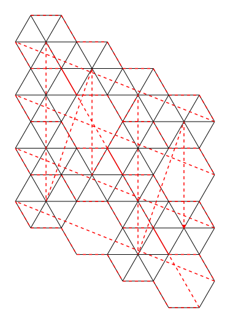
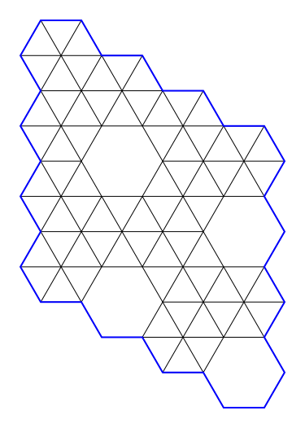
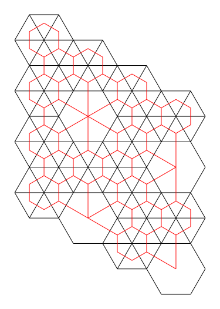

# Conversion to SVG

Each `Tiling` object has a `toSVG(...)` method that returns a
[Scalable Vector Graphics](https://en.wikipedia.org/wiki/Scalable_Vector_Graphics) XML,
describing the vector image.

```scala
import io.github.scala_tessella.tessella.conversion.SVG.*

val uniform3gonal2: Tiling = Tiling.threeUniformTwoOne(4, 4).toOption.get
uniform3gonal2.toSVG(showPerimeter = false, labelledNodes = LabelledNodes.NONE) // returns a SVG as scala.XML.Elem
```
```raw
<div style="width: 600px;">
```
|                                    |
|---------------------------------------------------------------|
| _Finite set of a **[2x(3⁶);(3⁴.6)]** pattern with edges only_ |
```raw
</div>
```

## Options

Several parameters can be mixed to add one or more information layers.

### Node labels

```scala
uniform3gonal2.toSVG(showPerimeter = false, labelledNodes = LabelledNodes.ALL)
```
```raw
<div style="width: 600px;">
```
|                                       |
|----------------------------------------------------------------|
| _Finite set of a **[2x(3⁶);(3⁴.6)]** pattern with node labels_ |
```raw
</div>
```

### Animated node order

```scala
uniform3gonal2.toSVG(showPerimeter = false, labelledNodes = LabelledNodes.NONE, showGrowth = true)
```
```raw
<div style="width: 600px;">
```
|                                                     |
|-----------------------------------------------------------------------------------|
| _Finite set of a **[2x(3⁶);(3⁴.6)]** pattern with animation following node order_ |
```raw
</div>
```

### Perimeter

```scala
uniform3gonal2.toSVG(showPerimeter = true, labelledNodes = LabelledNodes.NONE)
```
```raw
<div style="width: 600px;">
```
|                                           |
|--------------------------------------------------------------------------|
| _Finite set of a **[2x(3⁶);(3⁴.6)]** pattern with highlighted perimeter_ |
```raw
</div>
```

### Polygons

```scala
uniform3gonal2.toSVG(showPerimeter = false, fillPolygons = true, labelledNodes = LabelledNodes.NONE)
```
```raw
<div style="width: 600px;">
```
|                                                                 |
|----------------------------------------------------------------------------------------------|
| _Finite set of a **[2x(3⁶);(3⁴.6)]** pattern with filled polygons colored according to size_ |
```raw
</div>
```

### Gonality

```scala
uniform3gonal2.toSVG(showPerimeter = false, labelledNodes = LabelledNodes.NONE, markStyle = MarkStyle.GONALITY)
```
```raw
<div style="width: 600px;">
```
|                                                                          |
|-------------------------------------------------------------------------------------------------------|
| _Finite set of a **[2x(3⁶);(3⁴.6)]** pattern with dots marking nodes with the same adjacent polygons_ |
```raw
</div>
```

### Uniformity

```scala
uniform3gonal2.toSVG(showPerimeter = false, labelledNodes = LabelledNodes.NONE, markStyle = MarkStyle.UNIFORMITY)
```
```raw
<div style="width: 600px;">
```
|                                                                     |
|------------------------------------------------------------------------------------------------------|
| _Finite set of a **[2x(3⁶);(3⁴.6)]** pattern with dots marking nodes with the same adjacent pattern_ |
```raw
</div>
```

### Inversion

```scala
uniform3gonal2.toSVG(showPerimeter = false, labelledNodes = LabelledNodes.NONE, showInversion = true)
```
```raw
<div style="width: 600px;">
```
|                                           |
|--------------------------------------------------------------------------|
| _Finite set of a **[2x(3⁶);(3⁴.6)]** pattern with inverted tessellation  |
```raw
</div>
```
