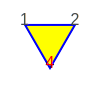
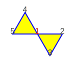

# `Tiling` validation

A `Tiling` instance that represents a valid tessellation is an undirected graph with the following properties.

## Labelling

### All vertices must be numbered starting from 1 and increasing by one with no gaps

```raw
<div style="width: 180px;">
```
|    |
|---------------------------------------|
| `Tiling` _with invalid labels_        |
```raw
</div>
```

@@@ warning { title='Failing' }

Three only vertices must be labelled 1, 2 and 3

@@@

## Nodes degree

### All vertices must be connected to at least 2 other vertices (node degree >= 2)

```raw
<div style="width: 220px;">
```
|          |
|---------------------------------------|
| `Tiling` _with invalid node degree 1_ |
```raw
</div>
```
@@@ warning { title='Failing' }

Vertex 4 has degree 1, is part of an open polygon

@@@

### All vertices must be connected to at most 6 other vertices (node degree <= 6)

```raw
<div style="width: 260px;">
```
|          |
|---------------------------------------|
| `Tiling` _with invalid node degree 7_ |
```raw
</div>
```

@@@ warning { title='Failing' }

Vertex 1 has degree 7, not valid since the regular polygon with the smaller interior angle, the regular triangle, fills the full angle with 6 units

@@@

## Nodes connection

### Graph must be connected

```raw
<div style="width: 260px;">
```
|    |
|-------------------------------------|
| `Tiling` _not connected_            |
```raw
</div>
```

@@@ warning { title='Failing' }

Vertices 1, 2, 3 are not connected to vertices 4, 5, 6

@@@

### All polygons at the same vertex must be adjacent

```raw
<div style="width: 260px;">
```
|  |
|---------------------------------------|
| Invalid `Tiling` ____________________ |
```raw
</div>
```

@@@ warning { title='Failing' }

Non-adjacent polygons at vertex 1, the graph is only "thinly" connected

@@@

## Angle of adjacent polygons

### Total interior angle of the adjacent polygons at the same vertex must be equal or less than a full circle

```raw
<div style="width: 280px;">
```
|  |
|---------------------------------------------------------------|
| Invalid `Tiling` ________________________                     |
```raw
</div>
```
@@@ warning { title='Failing' }

Three squares and a regular pentagon at vertex 5 make more than a full circle,
where a vertex on the perimeter of a tessellation must be less than full

@@@

```raw
<div style="width: 280px;">
```
|   |
|--------------------------------------------------------------|
| Invalid `Tiling` ________________________                    |
```raw
</div>
```
@@@ warning { title='Failing' }

Same as above, but now vertex 5 is internal and must be exactly full

@@@

```raw
<div style="width: 340px;">
```
|                              |
|---------------------------------------------------|
| Invalid `Tiling` ________________________________ |
```raw
</div>
```
@@@ warning { title='Failing' }

Considered that the "hole" is a hexagon,
the internal vertices 6, 7, 14, 15 are more than full
and 10, 11 are less than full

@@@

## Spatial requirements

### Any two vertices must not overlap

```raw
<div style="width: 320px;">
```
|    |
|---------------------------------------|
| `Tiling` _with overlapping vertices_  |
```raw
</div>
```

@@@ warning { title='Failing' }

Vertices 10 and 12 overlap

@@@

### Any two sides must not intersect

```raw
<div style="width: 320px;">
```
|               |
|------------------------------------|
| `Tiling` _with intersecting sides_ |
```raw
</div>
```
@@@ warning { title='Failing' }

Sides 3--12 intersecting with 4--10 and 9--10 with 12--13

@@@

```raw
<div style="width: 400px;">
```
|            |
|-----------------------------------|
| `Tiling` _with overlapping sides_ |
```raw
</div>
```
@@@ warning { title='Failing' }

Sides 6--10 overlapping with 21--17 and 8--9 with 22--19

@@@

```raw
<div style="width: 400px;">
```
|            |
|-----------------------------------|
| `Tiling` _with overlapping sides_ |
```raw
</div>
```
@@@ warning { title='Failing' }

Sides 8--9 overlapping with 23--19

@@@
