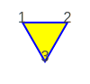

# What is a `Tiling`

An instance of the class `Tiling` that precisely describes a finite tessellation,
a collection of polygons that covers a finite 2-dimensional area without leaving any gap or overlap.

```raw
<div style="width: 180px;">
```
|  |
|-----------------------------|
| Smallest `Tiling`           |
```raw
</div>
```

Each polygon:

* is **regular**, all its sides and all its angles equal.
* has **unit size**, the length of each side is 1

@@@ note

Go to the next page for a more accurate [mathematical definition of tiling](tiling-definition.html) covering the whole 2-dimensional plane.

@@@

## How to build a `Tiling`

At the most basic level, a `Tiling` instance is built providing the edges of an undirected graph.

And only a constructor with validation is available; since a valid `Tiling` is always a graph, but the opposite is not true, see [Tiling validation](tiling-validation.html).

```scala
Tiling.maybe(1--2, 1--3, 2--3) // Right(Tiling(1--2, 1--3, 2--3))
```
